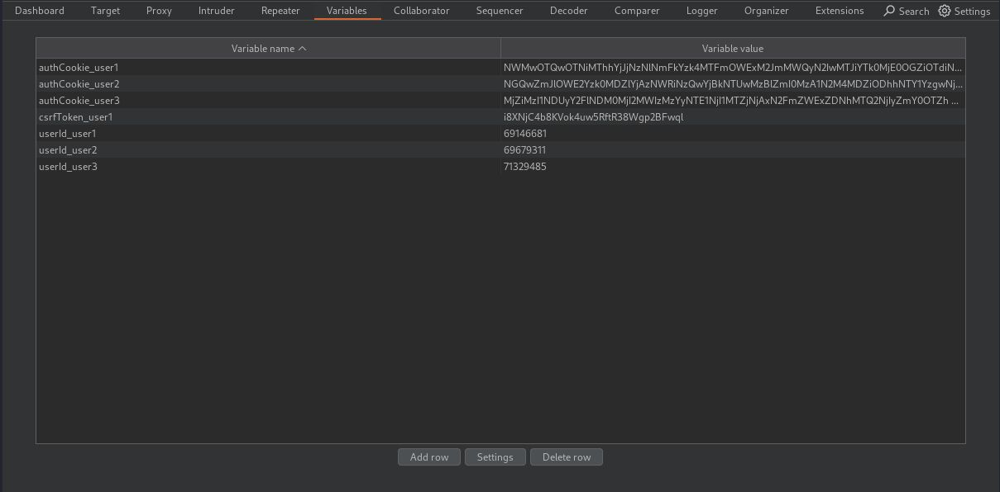
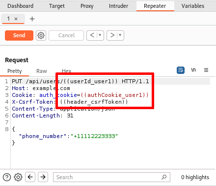
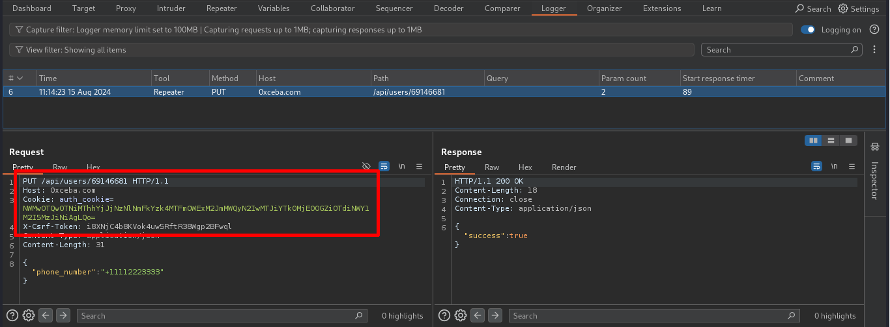

# Burp Variables
### Description
Burp Variables is a Burp Suite extension designed to add variable storage and reuse functionality to outgoing HTTP requests. Burp Variables is a productivity extension that allows users to insert placeholders into their requests, which are automatically replaced with defined values when the requests are sent. This extension fills a feature gap in Burp by introducing variable handling capabilities similar to those available in other web API testing tools like Postman and Insomnia. Variables are referenced with the notation `((variableName))` and can be included anywhere in a request.

### Features
* **Tool filtering:** Toggle which Burp tools perform variable replacement. By default, replacement is enabled for Repeater, Intruder, Scanner, and Extensions. Proxy replacement can be enabled only for in-scope requests.                                                                                                                                  
* **Auto-update variables:** When enabled, variable values can be automatically updated from HTTP responses. Define a regex pattern with a capture group in the "Variable update regex" column and the first capture group match will become the new variable value.                                                                                      
* **Import/Export:** Import and export variable data as CSV files to copy variables between projects.

### Installation
You can install this extension in one of two ways:

* **BApp Store (recommended):** Open Burp → Extensions → BApp Store and search for Burp Variables.
* **Latest release:** Download the `.jar` from the [Releases](../../releases) page and add it in Burp via Extensions → Installed → Add.

### Usage
1. Add variable name-value pairs to the table in the Variables tab:

   
2. Include variable references in any outgoing request by using the context menu provided by the extension or by manually typing the variable name:

   
3. Send the request and confirm that the variable references were replaced by viewing the request in the Logger tool:

   