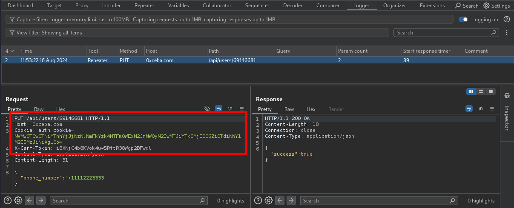

# Burp Variables
### Description
The Burp Variables extension enhances Burp Suite by enabling the storage and reuse of variables within HTTP requests, similar to functionality provided by tools like Postman and Insomnia. This extension supports referencing values in requests that are generated in the Repeater, Proxy, Intruder, Scanner, or Extensions tools. Variables are referenced with the notation `((variableName))` and can be included anywhere in a request. Variable data can be copied between projects by using the import and export options or by using Burp's [Import project file](https://portswigger.net/burp/documentation/desktop/projects/manage-project-files#importing-project-files) feature to import extension data.

### Usage
1. Add variable name:value pairs in the Variables tab:

   
2. Include variable references in a request by manually typing the variable name or by using the context menu added by the extension:

   
3. Send the request and confirm that the variable references were replaced by viewing the request in the Logger tool:

   