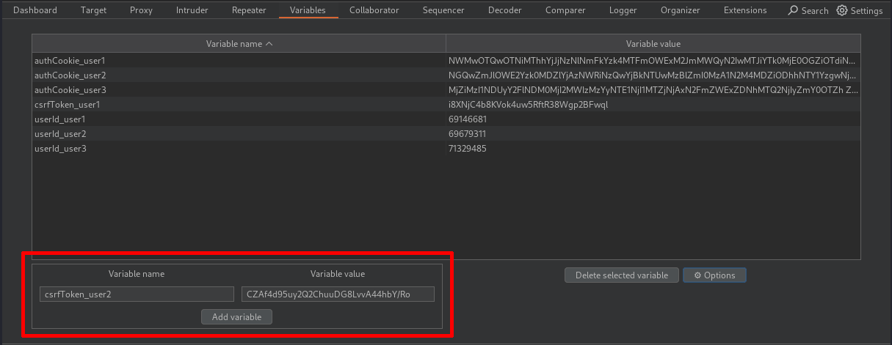
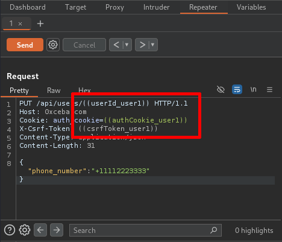

# Burp Variables
### Description
Burp Variables is a Burp Suite extension designed to add variable storage and reuse functionality to outgoing HTTP requests. Burp Variables is a productivity extension that allows users to insert placeholders into their requests, which are automatically replaced with defined values when the requests are sent. This extension fills a key feature gap in Burp by introducing variable handling capabilities similar to those available in other web API testing tools like Postman and Insomnia. Variables are referenced with the notation `((variableName))` and can be included anywhere in a request and variable data can be copied between projects by using the extension's import and export options.

### Usage
1. Add name:value variable pairs to the table in the Variables tab provided by the extension:

   
2. Include variable references in a request by manually inserting the variable name, or by using the context menu provided by the extension:

   
3. Send the request and confirm that the variable references were replaced by viewing the request in the Logger tool:

   